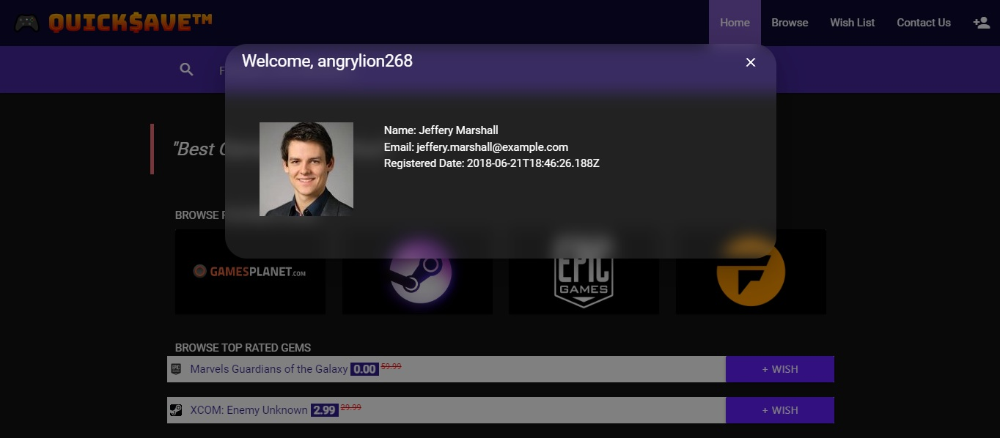
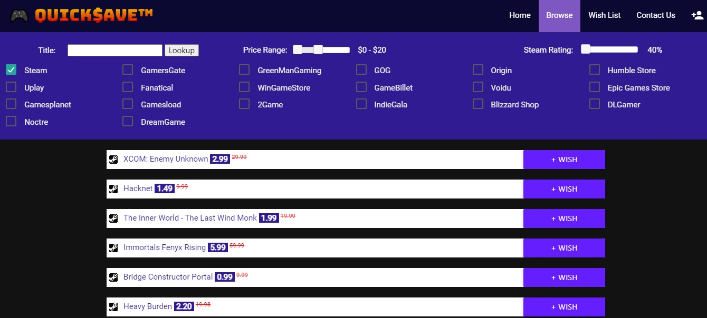
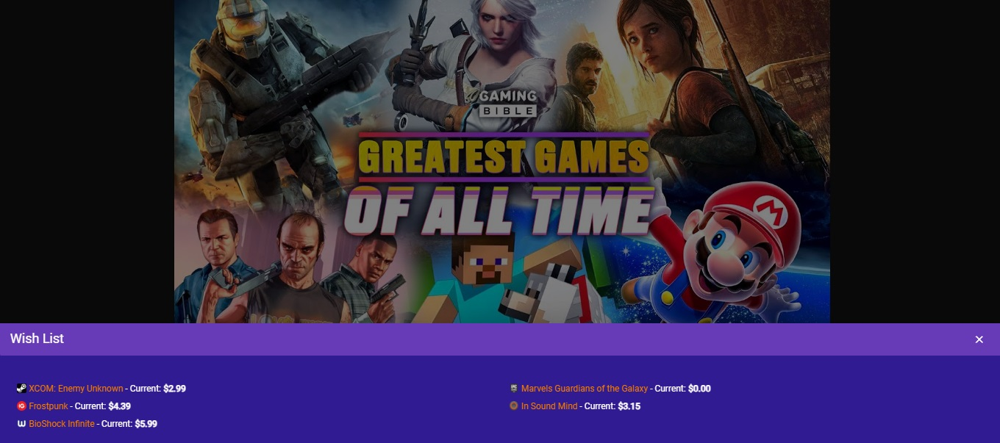

# Quick$ave - API Call Project
Game deals site developed utilizing API calls to return deals for customers.

## Description
Modernized game deals site to make searching for gaming deals easy and fun.


## Installation
Uitilize git clone to copy down project locally.
```bash
git clone git@github.com:CLTJared/api-quicksave.git
```

## Contributors
* Jared Elliott
* Michael Hooks
* Kal Parker

### Contributions
Pull requests are welcome. For major changes, please open an issue first to discuss what you would like to change.

## Utilities & APIs
We utilized the following tools in our project. Check them out below.
* [API:CheapShark](https://apidocs.cheapshark.com/)
* [API:RandomUser](https://randomuser.me)
* [jQuery/jQueryUI](https://jquery.com)
* [Materialize](https://materializecss.com/)

## Demo
[Site Demo](https://cltjared.github.io/api-quicksave/home.html)

## Pitch Deck
[Pitch Deck](./assets/Click$ave%20-%20Presentation.pdf)

### Screenshot




